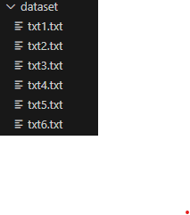
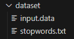
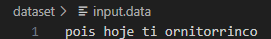
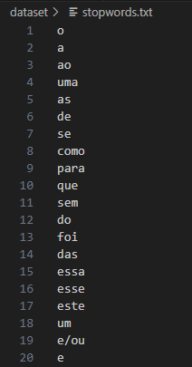
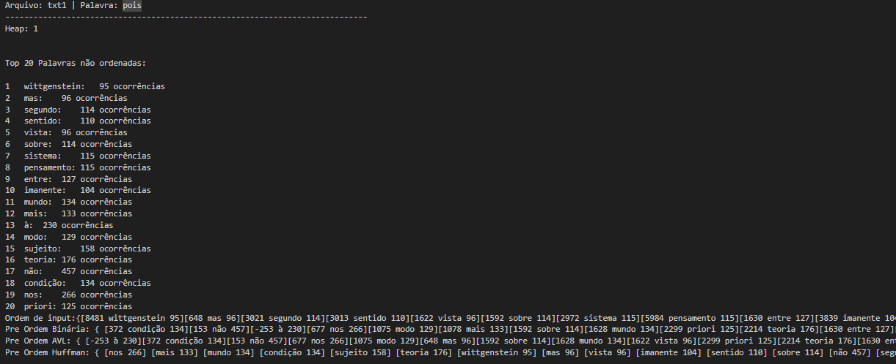

# Sistema de Sugestão de Palavras

>Status: Finalizado

## Objetivo
Foi proposto na disciplina de Algoritmos e Estrutura de Dados, um trabalho no qual o objetivo era desenvolver uma ferramenta ou programa que, tendo como entrada uma palavra específica chamada "busca" e um texto, seja capaz de gerar sugestões para a próxima palavra que provavelmente seguiria a palavra de "busca". Essas sugestões serão derivadas de uma análise das palavras mais frequentes presentes no texto. Para alcançar esse objetivo, construiremos sobre o trabalho prévio realizado [Top K Elementos](https://github.com/MatheuAlves/Top_K_Elementos)  e aprimoraremos a funcionalidade existente.

## Leitura de arquivos
O código aceita quantos arquivos o usuário quiser, desde que estejam nesse padrão:
- Nome do arquivo seja : "txtn.txt" (onde 'n' seja um número inteiro e esteja em ordem crescente em relação ao último algarismo no nome do último arquivo);
- A variável "num_files" que está no "main.cpp" tem que ser alterada para quantidade de arquivos que deseja ler;
- O arquivo de entrada esteja na pasta "dataset";
- É possível remover as palavras que quiser adicionando a mesma no arquivo "stopwords.txt" na pasta "dataset".

***Para padrão da atividade foram utilizados 6 arquivos:***

  

Além disso, temos arquivos auxiliares:

  

**input.data:** contém as palavras que devem ser pesquisadas, caso exista no documento de entrada ele criará a heap, se não houver mostrará no arquivo de saída. 
Abaixo tem o arquivo padrão utilizado, onde as palvras devem estarem separadas por espaço em branco ou em linhas diferentes:

  

**stopwords.txt:** seu conteúdo deve ser representado pelas stopwords a serem removidas no texto, e deve conter o seguinte formato: 

  

Depois de executado, um arquivo chamado "output.txt" será criado e adicionado na pasta dataset. Esse arquivo irá mostrar qual o arquivo "txtN.txt" que foi processado, a palavra-alvo pesquisada nos N textos, sua frequência de ocorrência, bem como as palavras mais relevantes identificadas, juntamente com suas respectivas frequências e valores.Além disso exibirá as pré-ordens em relação a cada árvore empregada no projeto.

## Lógica
Após a leitura de arquivos e inicialização das variavéis importantes para o funcionamento o algoritmo iniciará o processo de busca das palavras-chave indicadas e suas respetivas sugestões.

Inicialmente, o programa abre o primeiro arquivo de entrada disponíveis para pesquisa e compara a palavra chave a ser pesquisada. Caso a palavra-chave não esteja presente no arquivo em específico, o algoritmo imprime o resultado negativo no "output.txt" e passa para o próximo arquivo.

Quando o sistema encontra a palavra de pesquisa em um arquivo de entrada, prossegue com a etapa de busca das top K palavras mais relevantes dentro do contexto. A partir dai é montada a HEAP seguindo os padrões do algoritmo [Top K Elementos](https://github.com/MatheuAlves/Top_K_Elementos), previamente citado.

Após a conclusão dessa etapa essas palavras serão inseridas em três estruturas diferentes:

<ul>
<li> <strong>Árvore Binária:</strong> Uma árvore binária é uma estrutura de dados em que cada elemento, chamado de nó, pode ter até dois descendentes, um à esquerda e outro à direita. Cada nó carrega um valor e segue uma hierarquia, com um nó especial chamado de raiz no topo. Essas árvores são amplamente empregadas na ciência da computação para organizar dados de forma hierárquica e servem como base para estruturas mais complexas, como árvores de busca binária. Essas árvores possibilitam a realização eficaz de operações como busca e manipulação de dados em uma estrutura hierárquica.  
<li> <strong>Árvore AVL:</strong> Uma árvore AVL é uma variação de uma árvore binária de busca que mantém o equilíbrio automático. Cada nó em uma árvore AVL tem, no máximo, dois filhos (esquerda e direita), assim como em uma árvore binária. No entanto, a diferença crucial é que em uma árvore AVL, a altura das subárvores esquerda e direita de qualquer nó não pode diferir em mais do que uma unidade. Isso garante que a árvore permaneça balanceada, o que resulta em um tempo de busca eficiente, mantendo a altura da árvore relativamente baixa. Quando ocorrem inserções ou exclusões que desequilibram a árvore, rotações específicas são aplicadas para restaurar o equilíbrio. As árvores AVL são valiosas em aplicações onde é fundamental manter um desempenho consistente em operações de busca e inserção de dados.  
<li> <strong>Árvore de Huffman:</strong> Uma árvore de Huffman é uma estrutura de dados usada para compactar dados, especialmente em algoritmos de compressão de dados. Ela é construída com base na frequência de ocorrência de símbolos em um conjunto de dados. Cada símbolo é representado como uma folha da árvore, e a probabilidade de cada símbolo é usada para determinar a sua profundidade na árvore. Símbolos mais frequentes têm profundidades menores. A árvore de Huffman é binária e, quando completa, gera códigos de tamanho variável, chamados códigos de Huffman, onde símbolos frequentes são representados por códigos mais curtos e símbolos menos frequentes por códigos mais longos. Essa árvore é usada para codificar e decodificar dados, proporcionando uma compressão eficiente, onde símbolos comuns são representados de forma econômica.
</ul>

## OutPut

  

## Conclusão

No decorrer do projeto, consegui explorar e aplicar estruturas de dados avançadas, notadamente as árvores binárias, que desempenharam um papel fundamental no armazenamento e análise dos principais K itens. À medida que avançava com o algoritmo, minha compreensão aumentou quanto à complexidade e eficácia das árvores na organização de conjuntos de elementos.